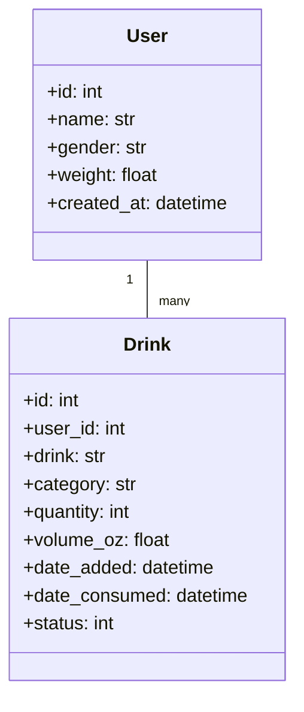

# Alcohol Consumption Tracker CLI
A comprehensive command-line tool for tracking alcohol consumption with personalized safety monitoring and health guidelines.

## Table of Contents

1. Features
2. Installation
3. Quick Start
4. Usage
   - Command Reference
   - Examples
5. Safety Guidelines
6. Technical Specification
7. Contributing
8. License

## Features

- Precise Tracking: Monitor consumption by  day and week
- Personalized Limits: Gender and weight-specific recommendations
- BAC Estimation: Widmark formula-based calculations
- Interactive CLI: Tab completion and rich output formatting
- Data Management: Full CRUD operations for drink entries

## Installation

### Prerequisites

- Python 3.7 or higher
- pip package manager

### Steps

1. Clone the repository:
   ```bash
   git clone https://github.com/yourusername/alcohol-tracker.git
   cd alcohol-tracker
   ```

2. Install dependencies:
   ```bash
   pip install typer
   pip install sqlachemy
   ```

3. (Optional) Enable shell completion:
   ```bash
   python3 lib/tracker.py --install-completion
   ```

## Quick Start

1. Initialize your profile:
   ```bash
   python3 lib/tracker.py profile
   ```

2. Add your first drink:
   ```bash
   python3 lib/tracker.py add --drink "Beer" --category "Beer" --quantity 1
   ```

3. View your dashboard:
   ```bash
   python3 lib/tracker.py show
   ```

## Usage

### Command Reference

| Command   | Description                          | Options                              |
|-----------|--------------------------------------|--------------------------------------|
| `add`     | Add new drink entry                  | `--drink`, `--category`, `--quantity`|
| `delete`  | Remove drink entry                   | `--id` (required)                    |
| `update`  | Modify existing entry                | `--id`, `--drink`, `--category`      |
| `consume` | Mark drink as consumed               | `--id` (required)                    |
| `show`    | Display all entries                  | None                                 |
| `profile` | Manage user profile                  | None                                 |

### Examples

Add a custom drink:
```bash
python3 lib/tracker.py add 
  --drink "tusker" 
  --category "Beer" 
  --quantity 2 
  --volume 16 
  --unit "ml"
```

Update an existing entry:
```bash
python3 lib/tracker.py update --id 3 --drink "Red Wine" --category "Wine"
```

View consumption dashboard:
```bash
python3 lib/tracker.py show
```

## Safety Guidelines

### Recommended Limits

| Time Frame | Male Limit | Female Limit |
|------------|------------|--------------|
| Weekly     | ≤14 units  | ≤7 units     |
| Daily      | ≤4 units   | ≤3 units     |
| Per Sitting| ≤3 units   | ≤2 units     |

### BAC Threshold Warnings

- 0.02-0.05%: Mild impairment possible
- 0.05-0.08%: Significant impairment likely
- >0.08%: Legally intoxicated in most areas

## Technical Specifications

### Data Model



### Dependencies

| Package      | Version | Purpose               |
|--------------|---------|-----------------------|
| SQLAlchemy   | ≥1.4    | Database ORM          |
| Typer        | ≥0.4    | CLI framework         |
| Rich         | ≥10     | Terminal formatting   |


## Contributing

We welcome contributions! Please follow these steps:

1. Fork the repository
2. Create a feature branch
3. Commit your changes
4. Push to the branch
5. Open a pull request

Development Setup:
```bash
git clone https://github.com/yourusername/alcohol-tracker.git
cd alcohol-tracker
python -m venv venv
source venv/bin/activate
pip install -e ".[dev]"
pre-commit install
```

## License

This project is licensed under the MIT License.

---

Disclaimer:


 This application provides health information for educational purposes only and should not be considered medical advice. Always drink responsibly and consult with healthcare professionals regarding alcohol consumption.
